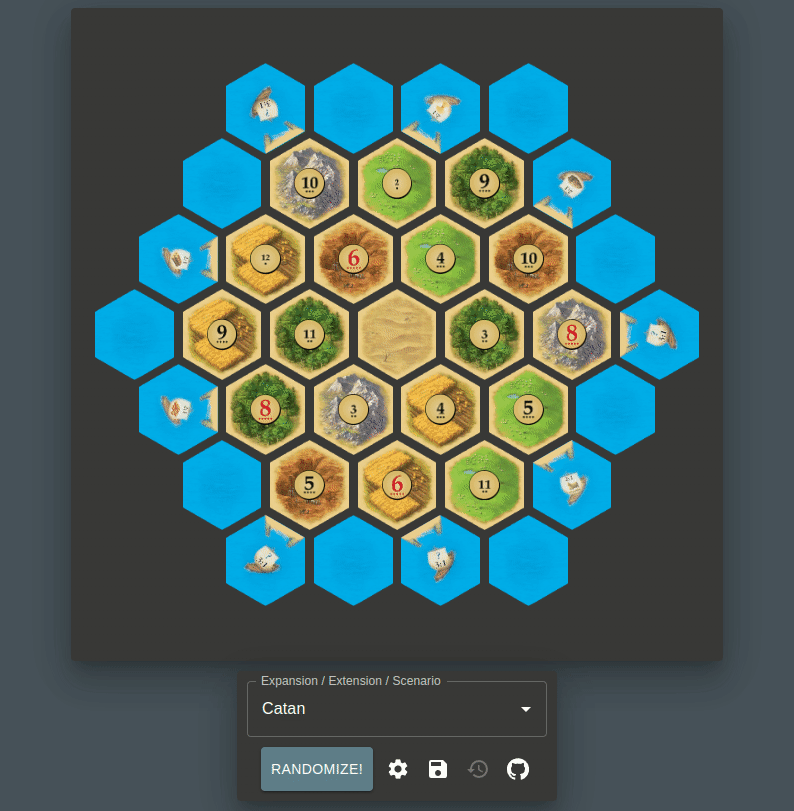
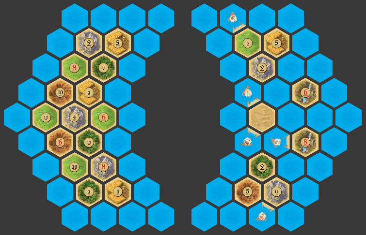
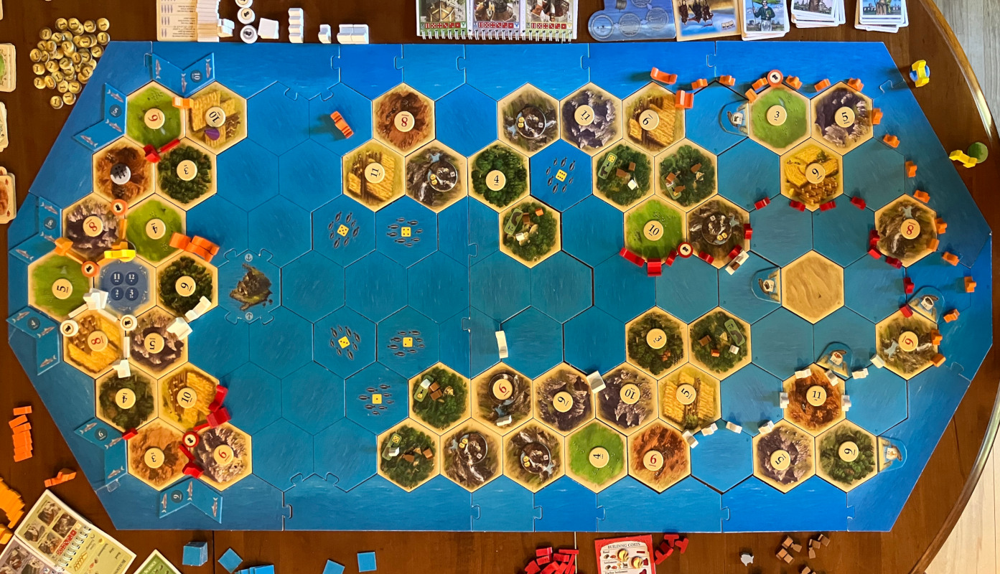

# Catan Randomizer

  

This is a hobby project to produce randomized [Catan](https://www.catan.com) boards under
constraints, e.g. `6` and `8` can't touch, or the
[pip](<https://en.wikipedia.org/wiki/Pip_(counting)>) count for each
intersection (the sum of pips on adjacent [number
chits](<https://en.wikipedia.org/wiki/Chit_(board_wargames)>)) can't exceed a
certain total. It is deployed [here](https://catan-randomizer.vercel.app/).

While the same idea has been executed
[many](https://jkirschner.github.io/catan-randomizer/)
[times](https://catan.bunge.io/)
[before](https://alexbeals.com/projects/catan/), this project supports [fairness
constraints](#supported-constraints), [Catan
Expansions](https://www.catan.com/explore-catan/catan-core-family-games), and
[custom](#expanded-versions)
[scenarios](#everything-everywhere-all-at-once) that aren't seen
elsewhere.

## Supported Constraints

- 6 & 8 can't touch
- 2 & 12 can't touch
- Same number can't touch
- Limit on the size of groups of same-type terrain
- Limit on the total pip count of intersections
- For scenarios featuring a variable number of islands, a lower limit on the
  number of islands created. See
  [Seafarers](#on-scenarios-with-a-variable-number-of-islands) for details

## Supported Expansions/Extensions/Scenarios

### Catan

Both [Catan](https://www.catan.com/catan) and [Catan: 5-6 Player
Extension](http://catanshop.com/the-settlers-of-catan-5-6-player-extension)
are supported.

### Cities & Knights

[Cities & Knights](https://www.catan.com/cities-knights), which is identical to
[Catan](#catan) except for the recommended beginner setup, is supported.

### Traders & Barbarians

All scenarios described in the manual are supported in every aspect, and
combinations of _The Fishermen of Catan_ and other scenarios have been added
where appropriate.

#### On Shuffling _Barbarian Attack_

Numbers and terrain are shuffled in two separate ("inner" and "outer") groups.
It isn't possible to construct the inner group with fewer than 11 pips per
intersection, so make sure to adjust your constraints accordingly.

#### Spinning Oasis

Wherever applicable, the Oasis hex from _The Caravans_ scenario is randomly
spun to increase board variability. The official rules specify that it's always
in a fixed orientation, so if you prefer that, ignore the orientation that the
shuffler produces.

#### Combinations with _The Fishermen of Catan_

This section details ways to combine _The Fishermen of Catan_ with each of the
other _Traders & Barbarians_ scenarios and other expansions. Note that some
combinations differ from the [official
combinations](https://www.catan.com/traders-barbarians). In particular, we
almost always include the lake, whereas the official combinations frequently
exclude it, and we sometimes recommend a different choice for hex/chit removal.
You should still read the official rules for each combination, some of which
include additional rules. Note also that preparation for the combination with
_Cities & Knights_ is just a matter of using the normal _The Fishermen of
Catan_ setup, so there is no additional board specified.

- _The Rivers & Lakes of Catan_: Combination with _The Rivers of Catan_.
  One grain hex and the 2 & 12 chits have been removed to make way for the
  lake. See [below](#fishing-without-2-%26-12-chits).
- _The Fishy Caravans_: Combination with _The Caravans_. One forest hex has
  been removed to make way for the lake, and the 2 & 12 chits have been
  combined onto a single hex.
- _Barbarians Attack the Fish_: Combination with _Barbarian Attack_. One of the
  interior grain hexes and the interior 3 chit have been removed to make way
  for the lake.[^fish-attack-details]
- _Traders & Barbarians & Fish_: Combination with _Traders & Barbarians_. Since
  the 2 & 12 chits are already not present on the board, a 3 chit along with a
  forest hex are removed to make way for the lake. See
  [below](#fishing-without-2-%26-12-chits).
- _Traders & Barbarians Ultimate_: [The "Ultimate" community-created _Traders &
  Barbarians_ setup that combines all five
  scenarios](https://www.catan.com/sites/default/files/2022-08/Traders%20%26%20Barbarians%20Ultimate_new.pdf).
  - There are 18 total variations on the placement of scenario hexes which the
    authors suggest you choose by rolling a 3-color die and a number die. The
    map names are as such suffixed with `\((green|purple|orange) [1-6]\)`. If
    you don't speak [regex](https://en.wikipedia.org/wiki/Regular_expression),
    that's e.g. _Traders & Barbarians Ultimate (green 1)_.
  - There are no sea hexes in three of the corners to show where to make space
    between the borders. However, if you have one hex length pieces from other
    expansions, it is recommended that you use them so the border is stable.
- Combinations with [_Explorers & Pirates_](#explorers-%26-pirates): In both
  cases, one pasture hex and the 12 chit have been removed to make way for the
  lake. See [below](#fishing-without-2-%26-12-chits), noting that there is a 2
  pirate's lair/goldmine chit that may come into play later in the game. Once
  this is revealed, players may choose to add the removed 12 chit to the same
  hex and then play normally, ignoring the recommendations below. Alternately,
  since gold is distributed on no production rolls in _E & P_, the
  recommendations below may be ignored from the outset.
  - _Explorers & Pirates & Fish_: _E & P_ with fishing ground tiles and a lake.
  - _Explorers & Pirates & Cities & Knights & Fish (Oh My!)_: The same, but
    configured as recommended for combination with [_Cities &
    Knights_](#cities-%26-knights), i.e. with a grain hex substituted for a
    forest hex.
- Combinations with [_Seafarers_](#seafarers):
  - _New World of Fish_: The _New World_ scenario with fishing ground tiles but
    no lake.
  - _New World of Fish Expanded_: The [_New World Expanded_
    scenario](#expanded-versions) with fishing ground tiles and a lake.
  - _New World of Fish & Islands_: The [_New World Islands_
    scenario](#expanded-versions) with fishing ground tiles and a lake.
- Combinations with [_Explorers & Pirates_](#explorers-%26-pirates) & [_Seafarers_](#seafarers):
  - _Everything, Everywhere, All at Fish_ - [Everything, Everywhere, All at
    Once](#everything-everywhere-all-at-once) with the same changes mentioned
    above in "Combinations with _Explorers & Pirates_."
  - _Everything, Everywhere, All at Fish, Variable_ - Ditto for [Everything,
    Everywhere, All at Once, Variable](#everything-everywhere-all-at-once-variable).
  - _Seafarers & Piratical Fish_ - Ditto for [Seafarers & Pirates](#seafarers-and-pirates).
  - _Seafarers & Piratical Fish, Variable_ - Ditto for [Seafarers & Pirates,
    Variable](#seafarers-and-pirates-variable).

[^fish-attack-details]:
    _Barbarian Attack_ is constructed so that every number chit is represented
    exactly once along the coastline, so it isn't possible to remove or
    combine the 2 & 12 chits without altering the scenario mechanics in an
    undesirable way.

##### Fishing without 2 & 12 chits

Combining _The Fishermen of Catan_ with other scenarios often necessitates
removing the 2 & 12 chits from the board. This section outlines some
recommendations for how to handle play when those numbers are rolled or drawn
from the Event Card stack.

- If either of 2 or 12 are rolled or drawn from the Event Card stack, resolve
  any events, distribute fish to players with cities or settlements adjacent to
  the lake, and then roll/draw again until a number 3-11 comes up. In the
  unlikely event that the other of the two 2/12 Event Cards is drawn, resolve
  it and again distribute fish, but ignore additional 2/12 rolls if playing
  with dice.[^two-twelve-card]
- If a 2 or 12 Event Card increases any player's resource card count, their
  card count remains as it was at the beginning of the turn for the purposes of
  a 7 roll. For example, if _Plentiful Year_ (2) is drawn and a player's card
  count increases to 8, they are not penalized if the next card is a 7.

[^two-twelve-card]:
    Since there is only one card for each of the 36 possible rolls, it would be
    unfair to players settled adjacent to the lake to ignore their fish
    production. However, since fair die rolls are [independent and identically
    distributed](https://en.wikipedia.org/wiki/Independent_and_identically_distributed_random_variables)
    events, subsequent 2/12 rolls can be ignored without compromising fairness.
    Event resolution is perhaps more open to argument. Decide amongst
    yourselves beforehand if you want to ignore the second/both 2/12 card
    events and just distribute fish.

##### Rules for arranging fishing ground tiles

There are no official rules for the variable placement of fishing ground tiles
(the rules for combining with Seafarers simply state "distribute ... according
to your personal taste"). Internally, the shuffler is enforcing the following
constraints:

1. All three points of each tile must be pointing at inhabitable intersections.
2. The hex on which a tile is placed must not contain a port but may be next to
   one. It may not contain more than one fish tile.
3. As with ports, no intersection may be adjacent to more than one fish tile.
   However, intersections adjacent to both a port and fish tile are valid.

Additionally, as noted in the official rules, the lake must always be inland,
i.e. not adjacent to any sea hex.

If you are receiving an error related to fishing ground tile placement, please
check that your board specification conforms to these rules.

### Explorers & Pirates

Shuffling of the starting island for [Explorers &
Pirates](https://www.catan.com/explorers-pirates) is supported, as is the
recommended starting island for combining with _Cities & Knights_ (see the
"Possible Combinations" tab on the [Explorers & Pirates product
page](https://www.catan.com/explorers-pirates)). There's no way to set up the
hidden islands face down without involving a third party, and assigned number
chits are gameplay-dependent, so no attempt is made to shuffle those.

### Seafarers

All [Seafarers](https://www.catan.com/seafarers) scenarios are supported,
including some custom _New World_ scenarios as well as a partially shuffled
version of the _The Pirate Islands_ scenario. Pains have been taken to observe
every aspect of variable setup specified in the manual for each scenario,
including things like shuffling the main and foreign islands separately,
restricting the pip count of certain positions or terrain types, and not
shuffling some/all islands and/or ports.

#### On scenarios with a variable number of islands

Some _Seafarers_ scenarios allow a variable number of islands to be created
during terrain shuffling. For these, a _Min Island Count_ constraint is
provided from the settings menu to allow for more control over the number of
distinct islands generated during the shuffling process. For scenarios which
have well-defined "main" and "foreign" islands, the main island is included in
this count.

The following scenarios support this constraint:

- _Heading for New Shores_
- _Through the Desert_
- _New World_
- _New World of Fish_
- _New World Expanded_
- _New World of Fish Expanded_
- _New World Islands_
- _New World of Fish & Islands_
- _Everything, Everywhere, All at Once, Variable_
- _Everything, Everywhere, All at Fish, Variable_
- _Seafarers & Pirates, Variable_
- _Seafarers & Piratical Fish, Variable_

Note that the maximum feasible number of islands is different from scenario to
scenario. For example, the shuffler can usually find a 7 island board for _New
World_, but since there are only two variable sea hexes in _Through the
Desert_, no more than 4 islands are possible. The shuffler will alert you if
the board is over-constrained in this or any other way.

#### On the _New World_ scenario

_New World_ is the final, fully randomized scenario for _Seafarers_.

Ports are shuffled such that they are placed with both docks pointing at a
terrain hex and no more than one total dock pointing at any given intersection.
Within those constraints, they are allowed to appear on any sea hex or border
position in this scenario. However, you may feel free to ignore random
placement and instead use the instructions from the manual (_"Shuffle... with
their reverse sides facing up. Starting with the oldest player... each takes a
[port] and places it..."_).

##### Expanded versions

There are two additional scenarios provided which do not appear in the manual:

- _New World Expanded_: Same as _New World_ but using the full frame and all
  terrain hexes, i.e. adding the 3 deserts, 2 gold fields, and remaining hill
  and mountain hexes (1 each). Gold fields are restricted to 3 or fewer pips to
  prevent overly favorable initial settlement opportunities. There is one more
  number chit than resource-producing hex[^extra-number-chit], so, following
  the _The Wonders of Catan_ scenario, the second 12 chit is excluded. It is
  recommended to increase the victory point goal for this board to 14.
- _New World Islands_: Same as _New World Expanded_, but with distinct and
  separately-shuffled main and foreign island areas. Following the _Through the
  Desert_ scenario, gold fields and some of the better number chits are
  reserved for the foreign island area. You can choose to allow or disallow
  initial settlements in the foreign island area, but the latter is
  recommended. Since gold fields can only appear on foreign islands, the pip
  restriction from _New World Expanded_ is removed.

[^extra-number-chit]:
    For the curious, the extra number chit is used exclusively in the _Cloth
    for Catan_ scenario, where each cloth island has a number chit on both its
    east and west sides representing separate villages.

#### On the _The Pirate Islands_ scenario

The manual claims, _"This scenario is balanced only if the given set-up is
maintained. Therefore, it should not be varied, except for the [ports]."_ These
instructions are respected in the _The Pirate Islands_ scenario, but fair
variable setups can still be achieved if we just fix the terrain and numbers of
the outer ("pirate") islands and the upper ("western") coastline of the main
("eastern") island. A _The Pirate Islands (Shuffled)_ scenario is provided
which shuffles the remaining hexes and number chits as well as the ports.

Note that this is a tightly constrained scenario; you may need to relax your
constraint settings in order to successfully shuffle it.

#### On the _The Wonders of Catan_ scenario

According to the manual, for variable setup, "the two terrain hexes adjacent
to the deserts shouldn't receive favorable numbers (neither 6 nor 8)." This is
observed in the _The Wonders of Catan_ scenario. However, one can't help but
wonder why the straight, which one must settle in order to build the Great
Bridge, isn't similarly constrained. If this seems unfair to you, a _The
Wonders of Catan (Straight Constrained)_ scenario is provided which disallows 6
or 8 appearing on either the desert- or straight-adjacent terrain hexes.

### Everything, Everywhere, All at Once

The "Possible Combinations" section of both the
[Seafarers](https://www.catan.com/seafarers) and [Explorers &
Pirates](https://www.catan.com/explorers-pirates) pages claim, "In the
[Seafarers and Explorers & Pirates] expansions, the ways of using ships and
settling new islands are so fundamentally different from each other that it is
**impossible to combine the expansions**. Besides, combining them doesn't make
much sense anyway. If you use a settler ship, you reach a new building site for
a settlement faster and more cost-effectively than when stringing together
various ships."

I claim that they haven't tried hard enough. Enter the _Everything,
Everywhere, All at Once_ scenario, which combines _Explorers & Pirates_,
_Seafarers_, and _Cities & Knights_ ([optional](#scenarios)).

  

**NB:** The _Orange Sun_ and _Green Moon_ islands, which, as noted
[above](#explorers-%26-pirates), must be manually shuffled, are not depicted by
the randomizer. Instead, an empty space between the main and _Far Islands_ is
displayed. See the [rules](#rules).

#### Scenarios

- _Everything, Everywhere, All at Once_ - Combines _Explorers & Pirates_,
  _Seafarers_, and _Cities & Knights_. Play to 27 VP.
- _Everything, Everywhere, All at Once, Variable_ - Same as _Everything,
  Everywhere, All at Once_, but with variable _Far Island_ shuffling. Subject
  to the [Min Islands](#on-scenarios-with-a-variable-number-of-islands)
  constraint.
- _Seafarers & Pirates_ - Combines _Explorers & Pirates_ and _Seafarers_. Play
  to 22 VP.
- _Seafarers & Pirates, Variable_ - Same as _Seafarers & Pirates_, but with
  variable _Far Island_ shuffling. Subject to the [Min
  Islands](#on-scenarios-with-a-variable-number-of-islands) constraint.

#### Rules

For brevity, _Explorers & Pirates_ is abbreviated _EP_, _Seafarers_ as _SF_,
and _Cities & Knights_ as _CK_.

If you have not read the rules for the _SF_/_CK_ combination or the _CK_/_EP_
combination, you must do so before attempting the _Everything, Everywhere, All
at Once_ scenarios (though not the _Seafarers & Pirates_ scenarios). Both
rulesets can be found in the "Possible Combinations" section of the [_CK_
page](https://www.catan.com/cities-knights). All rules from those combinations
apply unless explicitly contradicted below. It is recommended to play both of
the two expansion combinations at least once before attempting _Everything,
Everywhere, All at Once_.

- **Setup**:
  1. Begin by assembling the final scenario for _EP_. Remember to substitute
     an additional fields hex for a forest hex if playing in combination with
     _CK_. The randomizer will handle this for you if you select the correct
     [scenario](#scenarios).
  2. Then, using the 2 two hex length and 2 one hex length border pieces from
     _SF_, further extend the long side borders by three hex lengths on each
     side.
  3. Using _SF_ hexes and number chits, create an addition 5[^variable-islands]
     islands (henceforth _Far Islands_) as specified on the far side of the world.
- **Objective**: If playing with just _EP_ and _SF_, play is to 22 (17 for _EP_ + 5
  for _SF_). If also using _CK_, add an additional 5 points, for a grand total
  of 27 VPs.
- **Robber & Pirate**:
  - Only the _EP_ pirate is used. **VARIATION**: Add the robber. When any
    action that would move the robber or pirate occurs, the initiating player
    gets to choose which they will move. The robber could even do things like
    prevent spice (_EP_) retrieval when occupying a spice village. Make sure to
    agree to all rules about where the robber can occupy and what it does on
    each hex type beforehand.
  - Per the _EP_ rules, the pirate can be placed on any sea hex except along
    the coastline of the _EP_ main island, including in the area around the
    _Far Islands_. Also per the _EP_ rules, this _does not_ include border
    pieces.
  - The pirate's interaction with _EP_ ships and _SF_ shipping routes is the same
    as specified in the rules for each expansion. In particular:
    - _EP_: Ships may not move past the pirate without paying tribute unless
      the pirate is the same color as them. Ships may do battle with the
      pirate during the player's movement phrase as per the _EP_ rules.
    - _SF_: The pirate prevents any building or open shipping route movement
      on any adjacent route. The _SF_ pirate is neutral, so _all players_ are
      affected regardless of the pirate piece color. **VARIATION**: The pirate
      is always friendly towards the player of the same color, even where
      shipping routes are concerned. Make sure to agree on whether this is the
      case beforehand.
  - The pirate's interaction with _CK_ knights is the same as specified in the
    _SF_/_CK_ combination rules. In particular:
    - Knights may move to or be built on any unoccupied intersection of a trade
      route, including shipping routes.
    - If active at the beginning of your turn and adjacent to the pirate, a
      knight may chase the pirate away at the cost of its activation.
- **Settling Foreign Islands**:
  - Catan chits (_SF_) worth one VP each are awarded for each player's _first_
    settlement on each of the _Far Islands only_. Settlements on any part of
    the _Orange Sun_ or _Green Moon_ islands (_EP_) are _not_ thusly rewarded.
  - _Orange Sun_ and _Green Moon_ islands (_EP_) may be settled either with a
    settler ship (_EP_) or by building a shipping route (_SF_) to an
    intersection and then building a settlement. There are a few compelling
    reasons to do the latter, despite CATAN GmbH's claim that settler ships are
    always better:
    1. You are using all of your _EP_ ships for something else.
    2. You want to have a route available to move your _CK_ knights between
       islands or out into the open ocean to chase the pirate away (knights can
       exist on any unoccupied trade route intersection but cannot travel on
       _EP_ ships).
    3. You want to start expanding from a settlement instead of first having to
       build an _EP_ harbor settlement from which to launch _EP_ ships (_SF_
       shipping routes only require an adjacent settlement to start building).
  - The _Far Islands_ may _only_ be settled by building a shipping route (_SF_)
    to abut them and then building a settlement. In this way, an extra element
    of play and strategy is introduced: there is a race to build settlements on
    the far side of the _Orange Sun_ and _Green Moon_ islands so that a
    shipping route can be built from them towards one or more of the lucrative
    _Far Islands_.
- **Shipping Route (_SF_)/Ship (_EP_) Interaction**: None. _EP_ ships may sail
  freely through _SF_ shipping routes and vice-versa.
- **Ports & Trade**: The basic trading rate for _EP_ is 3:1, and it remains so
  here. However, all the 2:1 ports are in play, but only in the seas
  surrounding the _Far Islands_. **VARIATION**: Since it is no small feat to
  build a settlement on the _Far Islands_, players may wish to increase the
  favorability of trades from these ports to 1:1. Make sure to agree beforehand
  on which rate you wish to use.
- **Gold Mines**:
  - _Orange Sun_ and _Green Moon_ islands: Treat these as in _EP_. A
    settlement or harbor settlement built adjacent one of these mines (after
    the resident pirates are driven away, of course) produces 2 gold, and a
    city produces 4 gold.
  - _Far Islands_: Treat these as in _SF_. A settlement produces one resource
    of the player's choice, and a city produces two. While there's little
    compelling reason to do so until the endgame (e.g. for victory points that
    are slightly cheaper than cities, or if cities have run out), players may
    build harbor settlements on the _Far Islands_. If they do, harbor
    settlement production is the same as basic settlements, per usual.
  - **VARIATION**: Treat all gold mines identically in the manner of your
    choosing. Remember to agree on this beforehand.
- **Longest Road**: Since settling the _Far Islands_ requires long shipping
  routes, Longest Road is in play for all scenarios.
- **Largest Army**: If playing with _CK_ (_Everything, Everywhere, All at Once_
  scenarios), Largest Army is irrelevant, since Progress Cards instead of
  Development Cards are used. However, since the _Seafarers & Pirates_
  scenarios exclude _CK_ and hence include Development Cards, Largest Army is
  in play. **VARIATION**: Especially when playing without the robber, _CK_
  knights can feel under-utilized, since they're rarely in position the chase
  the pirate away, and displacement tends to happen less often, since _EP_ road
  networks tend to be smaller . A possible variation to the _Everything,
  Everywhere, All at Once_ scenarios is to add Largest Army back into play.
  To determine who to award it to, count only the _number_ of knights each
  player has, regardless of activation status or strength (basic, strong, or
  mighty). In this way, a new objective is added: Not only are players vying to
  have the strongest army to defend against the barbarians, they are also
  trying to assemble the largest army in terms of number of knights alone.

[^variable-islands]:
    The _Variable_ [scenarios](#scenarios) may have fewer than 5 _Far Islands_
    (6 including the main island), depending on the value of the [Min
    Islands](#on-scenarios-with-a-variable-number-of-islands) constraint.

#### Example

Here's a played out board constructed using the _Everything, Everywhere, All at
Fish_ scenario (_Everything, Everywhere, All at Once_ + _The Fishmen of Catan_
from _Traders & Barbarians_). Hope you have a large table!

  

## Other Features

- Save/load boards to/from [localStorage](https://developer.mozilla.org/en-US/docs/Web/API/Window/localStorage)
- Generate sharing links for saved boards

## Contributing

Pull requests are welcome! In particular, I haven't played every expansion and
kind of ran out of steam including the ones I don't even own, so if there's a
board configuration you'd like to see made available, please contribute!

Also, my graphic design skills are basic and uncultivated, so if something about
the aesthetics of the project is cringe-worthy to your much more refined eye,
please feel free to fix it.

The codebase is small and follows the general structure of a
[create-react-app](https://create-react-app.dev/) project, so it should be easy
to dive into, but here are some tips:

- Board definitions are in [src/data/expansions.ts](src/data/expansions.ts), and
  expansion names are in [src/types/boards.ts](src/types/boards.ts). Provided that
  any restrictions on variable setup can be encoded in a `CatanBoardTemplate` (see
  [boards.ts](src/types/boards.ts) for details), adding a new board is
  just a matter of adding a new board definiton and expansion name in these two
  files.
- All code and docs are formatted using [Prettier](https://prettier.io/) with
  default options. Any PRs should be, too.
- All shuffling logic is thoroughly tested and fully passing. Any fixes or
  additions should be, too.

## Attribution

All images are [ripped](https://en.wikipedia.org/wiki/Pdfimages) from the pdf
manuals found at [catan.com](https://www.catan.com/) and used without explicit
permission. The [favicon](https://en.wikipedia.org/wiki/Favicon) is a
cut-and-paste job of the front cover of the manual. As I do not profit in any
way from this project, this usage appears to be in line with the [Catan IP
guidelines](https://www.catan.com/guidelines-dealing-intellectual-property-catan).
However, on the off chance that you are associated with CATAN GmbH and feel
that this project harms your brand in any way, it will be swiftly and
enthusiastically scrubbed from public existence upon request.

## Uh, ports? Don't you mean harbors?

You may have noticed that the word "port" is used pervasively to refer to what
the Catan manuals call "harbors." I didn't do this on purpose, but once I
realized my mistake, I also realized it was actually a correction.
[Here](http://www.differencebetween.net/language/difference-between-port-and-harbor/)
are some appropriate definitions:

**harbor** _noun_ A place of safety for ships and other waterborne vessels.

**port** _noun_ A commercial water facility used for ships and their cargo.

In other words, since harbors are just mooring areas and have nothing to do with
goods and trade, what we have in Catan are more aptly called ports.
