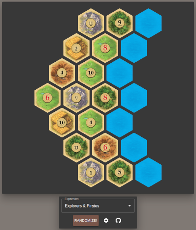
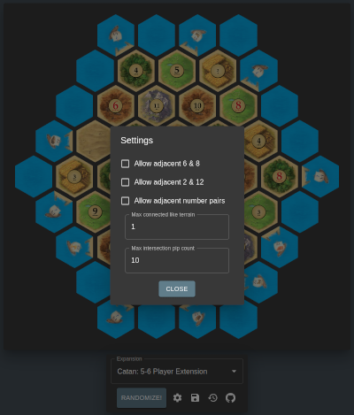

# Catan Randomizer

  
  

This is a hobby project to produce randomized [Catan](https://www.catan.com) boards under
constraints, e.g. `6` and `8` can't touch, or the
[pip](<https://en.wikipedia.org/wiki/Pip_(counting)>) count for each intersection
can't exceed a certain total. It is deployed
[here](https://catan-randomizer.vercel.app/).

While the same idea has been executed
[many](https://jkirschner.github.io/catan-randomizer/)
[times](https://catan.bunge.io/)
[before](https://alexbeals.com/projects/catan/), this project supports fairness
constraints (i.e. limiting intersection pip totals) and [Catan
Expansions](https://www.catan.com/explore-catan/catan-core-family-games) that
aren't seen elsewhere.

## Supported Constraints

- 6 & 8 can't touch
- 2 & 12 can't touch
- Same number can't touch
- Limit on the size of groups of same-type terrain
- Limit on the total pip count of intersections

## Supported Extensions/Expansions

- [Catan](https://www.catan.com/catan)
- [Catan: 5-6 Player Extension](http://catanshop.com/the-settlers-of-catan-5-6-player-extension)
- [Cities & Knights](https://www.catan.com/cities-knights)
- [Explorers & Pirates](https://www.catan.com/explorers-pirates)

## Contributing

Pull requests are welcome! In particular, I haven't played every expansion and
kind of ran out of steam including the ones I don't even own, so if there's a
board configuration you'd like to see made available, please contribute!

Also, my graphic design skills are basic and uncultivated, so if something about
the aesthetics of the project is cringe-worthy to your much more refined eye,
please feel free to fix it.

The codebase is small and follows the general structure of a
[create-react-app](https://create-react-app.dev/) project, so it should be easy
to dive into, but here are a couple of tips:

- Board definitions are in [src/data/expansions.ts](src/data/expansions.ts), and
  expansion names are in [src/types/boards.ts](src/types/boards.ts). Provided
  that variable setup follows the same rules as the base game, adding a new
  board is just a matter of adding a new board definiton and expansion name in
  these two files.
- In some expansions, e.g. [Seafarers](https://www.catan.com/seafarers), variable
  setup is restricted in ways that are not currently conceptualized in code. For
  example, there may be multiple sets of hexes and chits, some of which are
  distributed on one island, and the others of which are distributed elsewhere,
  or there may be an implicit constraint that certain hexes not receive numbers
  which are "too favorable." The extant [interfaces](src/types/boards.ts) and
  [shuffling function](src/components/Randomizer.tsx) should be readily
  modifiable to include such concepts, but they are not currently implemented.
  Note also that hexes are rotated 90˚ in Seafarers.
- All code and docs are formatted using [Prettier](https://prettier.io/) with
  default options. Any PRs should be, too.

## Attribution

All images are [ripped](https://en.wikipedia.org/wiki/Pdfimages) from the pdf
manuals found at [catan.com](https://www.catan.com/) and used without explicit
permission. Additionally, the [favicon](https://en.wikipedia.org/wiki/Favicon)
is the same as that used at [catan.com](https://en.wikipedia.org/wiki/Favicon).
As I do not profit in any way from this project, this usage appears to be in
line with the [Catan IP
guidelines](https://www.catan.com/guidelines-dealing-intellectual-property-catan).
However, on the off chance that you are associated with CATAN GmbH and feel that
this project harms your brand in any way, it will be swiftly and
enthusiastically scrubbed from public existence upon request.
